# Only Windows Ogre Tutorial

The aim of this repo is to teach how to setup an Ogre project only on Windows using Visual Studio 19.

## ⚙ Setup

### Requirements

You would need:

- `git`
- `CMake`
- `Visual Studio 19`

### Ogre official guides
You can check for the [installation guide](https://ogrecave.github.io/ogre/api/latest/building-ogre.html) of Ogre if you want to.


### How I build it

First we will build `Ogre3D`

```
git clone https://github.com/OGRECave/ogre.git
cd ogre
cmake -S . -B build
cd build
cmake --build . --config release
cmake --build . --config release --target INSTALL
```


Let's go to Visual Studio, create a new `C++` project and then click on propperties

<p align="center">
    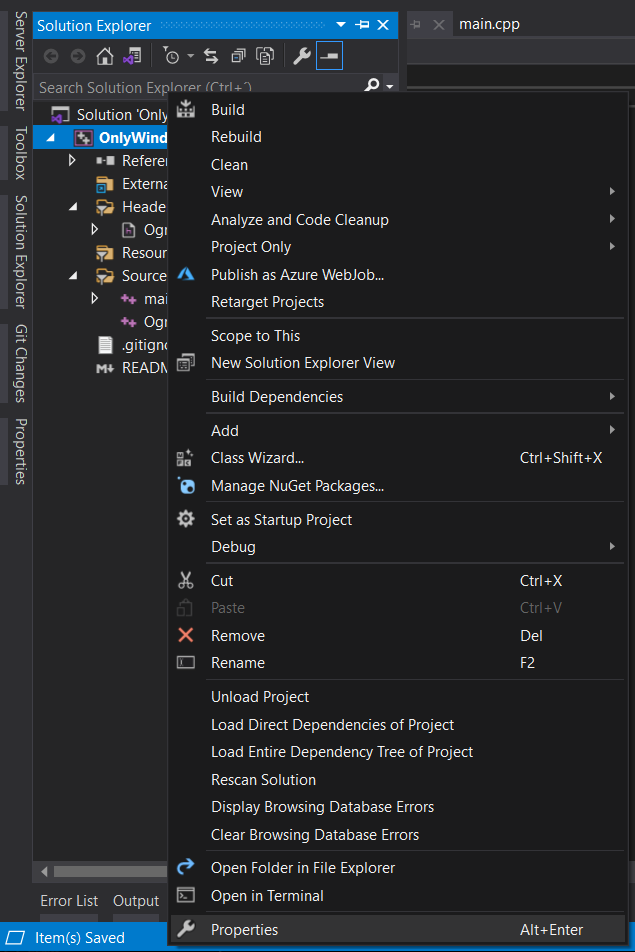
</p>

Go to `Linker` and click `Additional Library Directories`
<p align="center">
    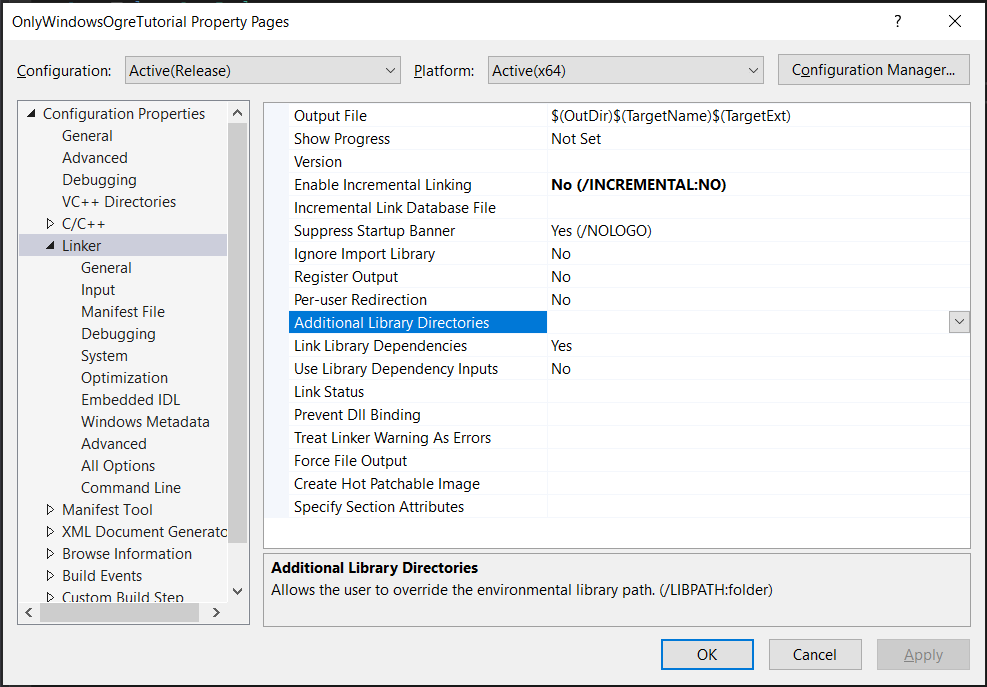
</p>

Click in New line
<p align="center">
    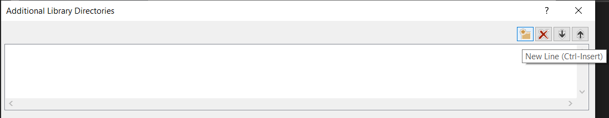
</p>

Go where you placed the `Ogre3D` GitHub repo, go to `build/lib/Release` and `Select folder`
<p align="center">
    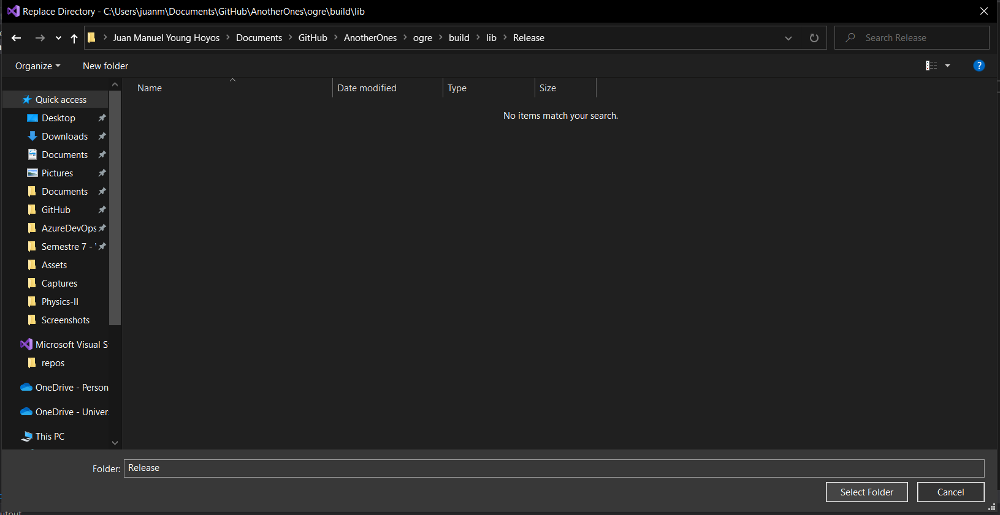
</p>

Click OK
<p align="center">
    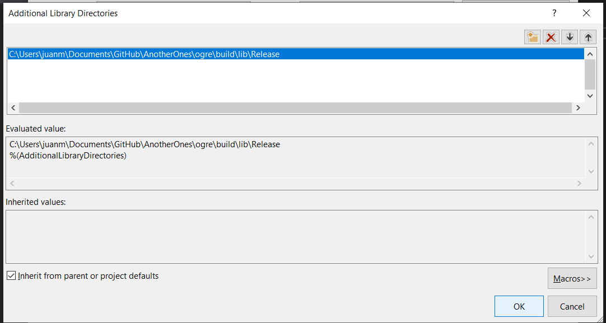
</p>

Go to C++ and click `Additiona Include Directories`
<p align="center">
    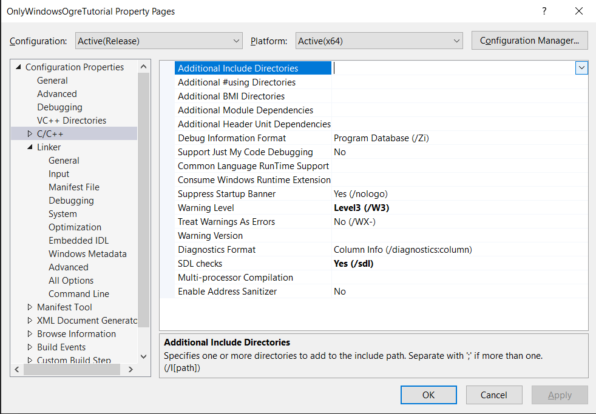
</p>

Click New Line and add the following folders
<p align="center">
    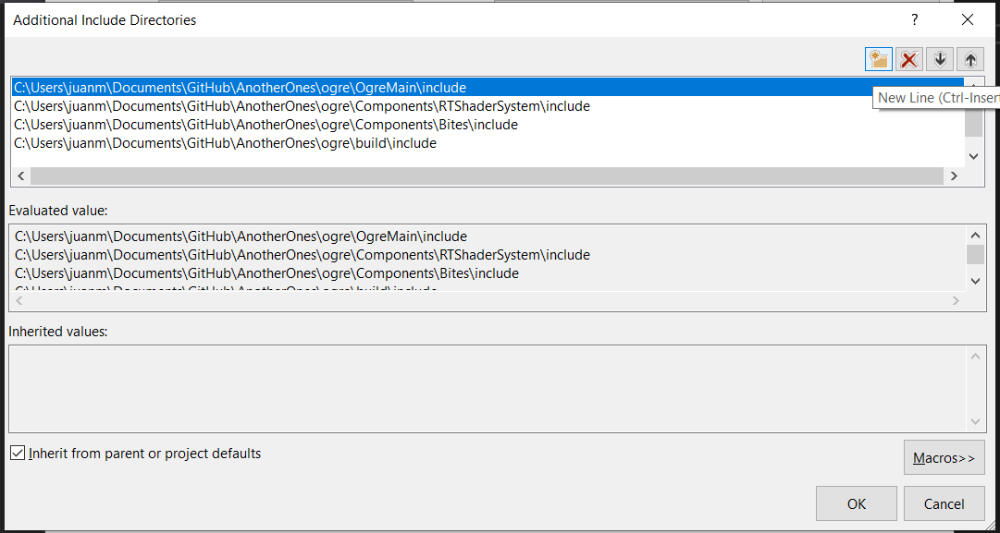
</p>

Go to `Linker`, `input` and Click `Additional Dependencies`:
<p align="center">
    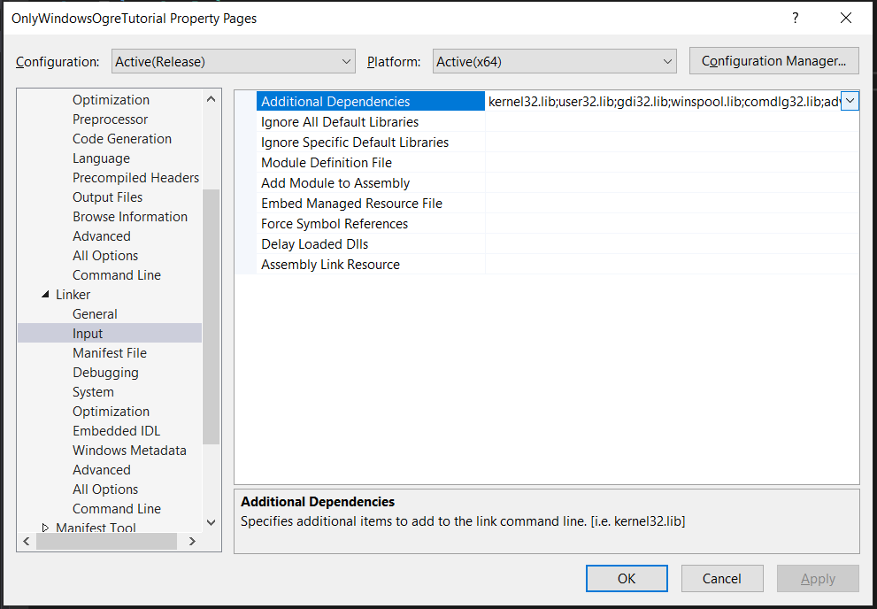
</p>

And add the following `.lib` files.
<p align="center">
    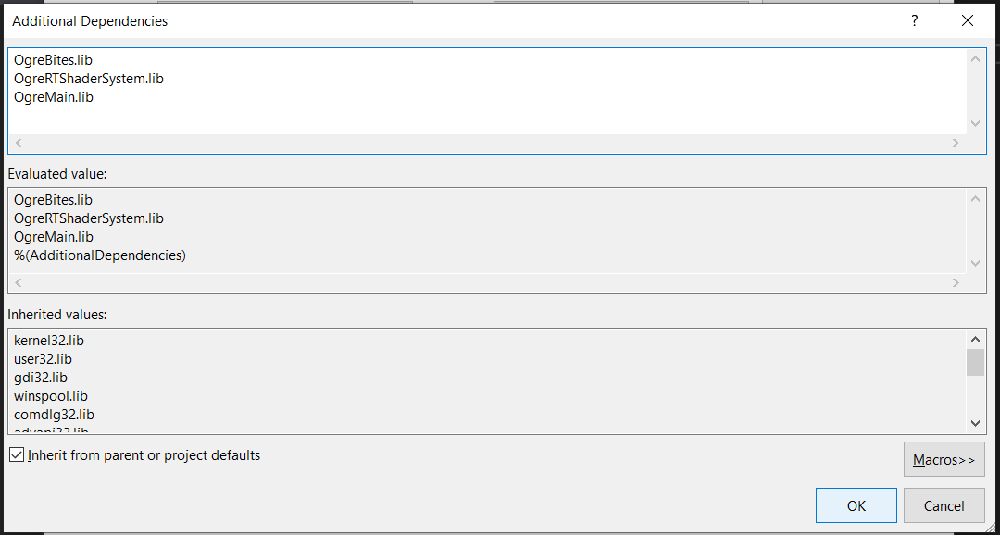
</p>

Go where you placed the `Ogre3D` GitHub repo and go to `build/bin/release` 
<p align="center">
    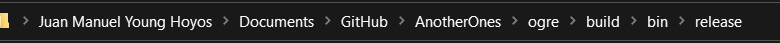
</p>

Copy all the `.dll` files
<p align="center">
    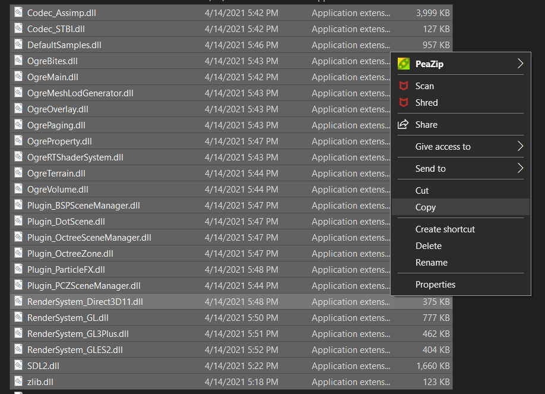
</p>

We paste it on our project
<p align="center">
    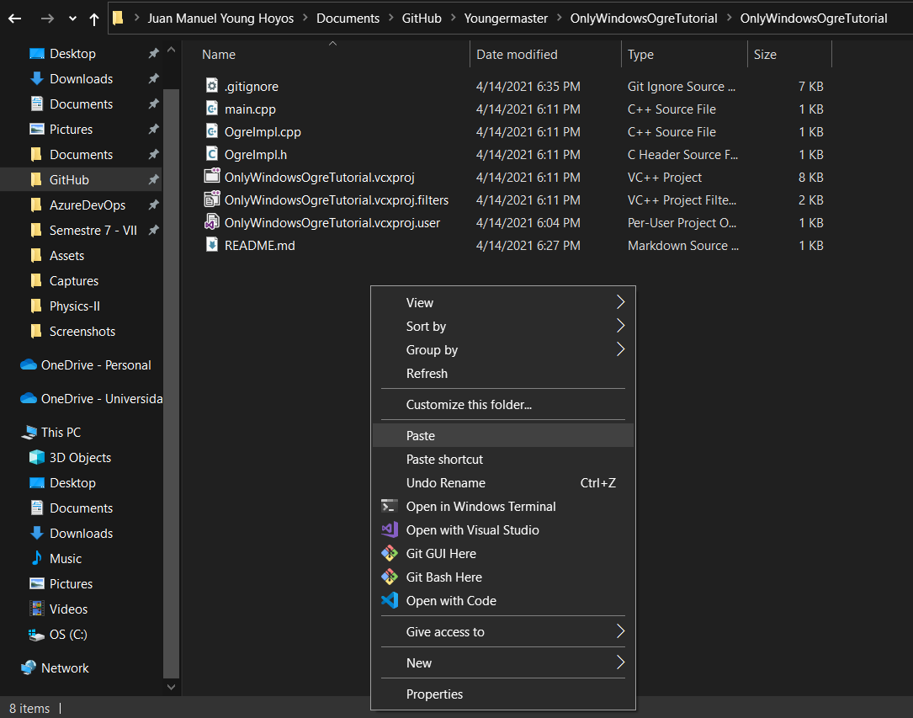
</p>

And also we copy these 2 `.cfg` files
<p align="center">
    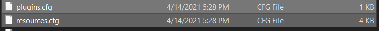
</p>

Let's run it
<p align="center">
    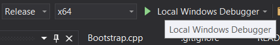
</p>

*Voila!* There we have it
<p align="center">
    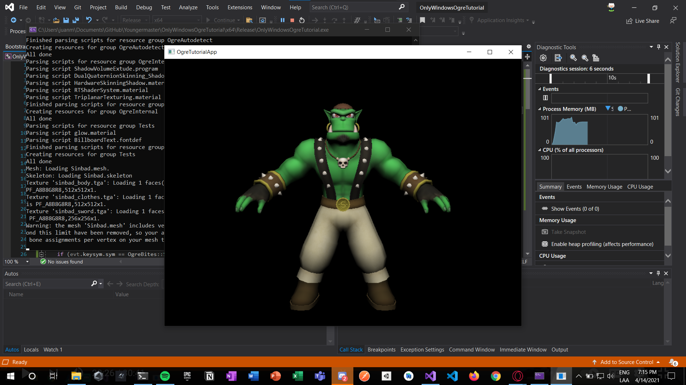
</p>

